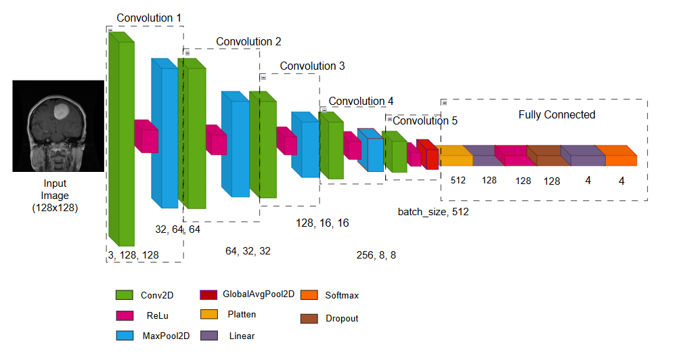

# 🧠 Brain Tumor Detection with CNN

A deep learning-based project for classifying brain MRI images into four classes: **Normal**, **Meningioma**, **Glioma**, and **Pituitary**.

---

## 🏗️ Model Architecture

Both the **PyTorch model** and the **Custom model** share the same CNN architecture:



*Figure: Convolutional Neural Network (CNN) architecture used in both models.*

---

## 📂 Project Structure

1. **`pytorch_model/`**  
   - Implementation using standard PyTorch modules.  
   - Includes training script, evaluation, and Grad-CAM support.

2. **`custom_model/`**  
   - Fully custom-built framework: manual implementations of layers (Conv2D, ReLU, MaxPool, etc.).  
   - Supports training, inference, feature map extraction, and backward visualization.

3. **`app_streamlit/`**  
   - Streamlit web app for real-time prediction and feature analysis.  
   - Supports both models with model selector, Grad-CAM, and batch prediction features.

---

## 📌 Highlights

- Identical architecture for fair comparison between PyTorch and custom models.
- Augmented MRI dataset for improved generalization.
- Modular design: train, analyze, and deploy independently.

## How to run
```
cd pytorch_model
python pytorch_model.py
```