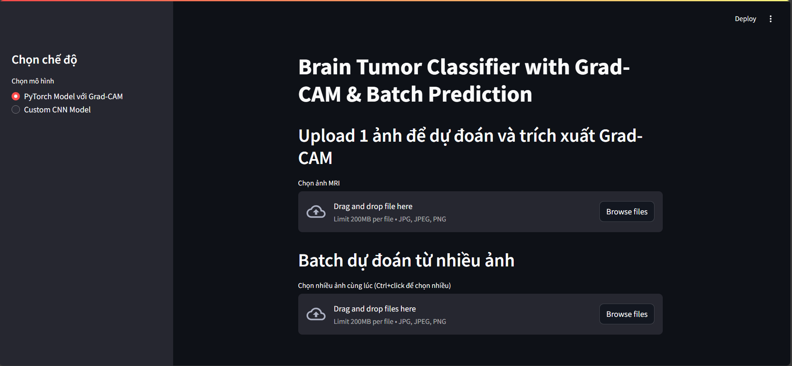
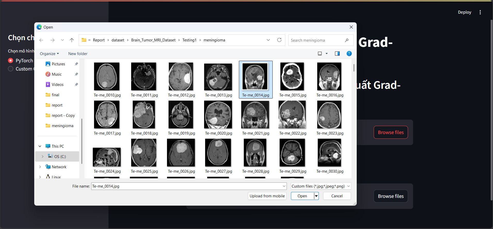
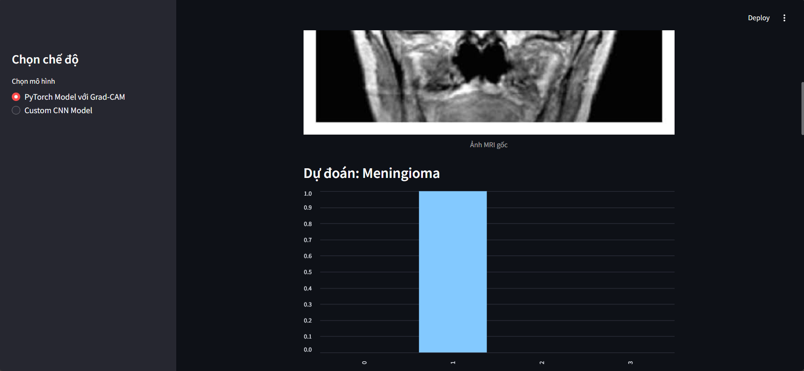
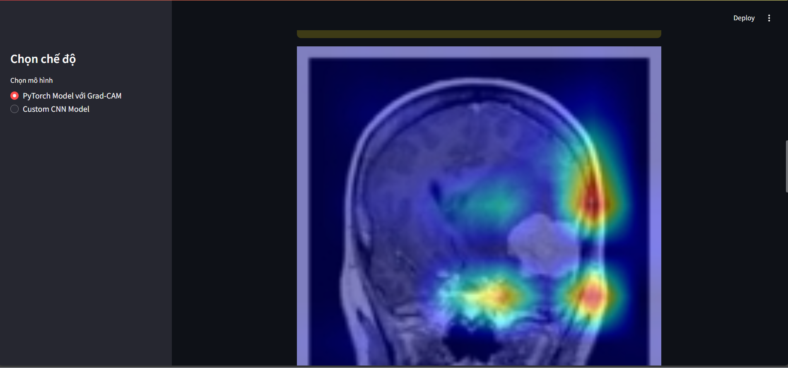
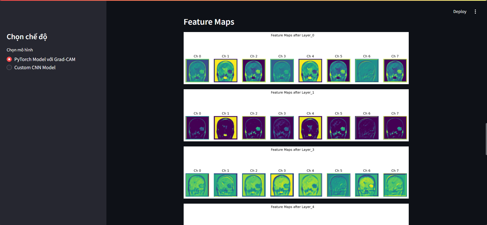
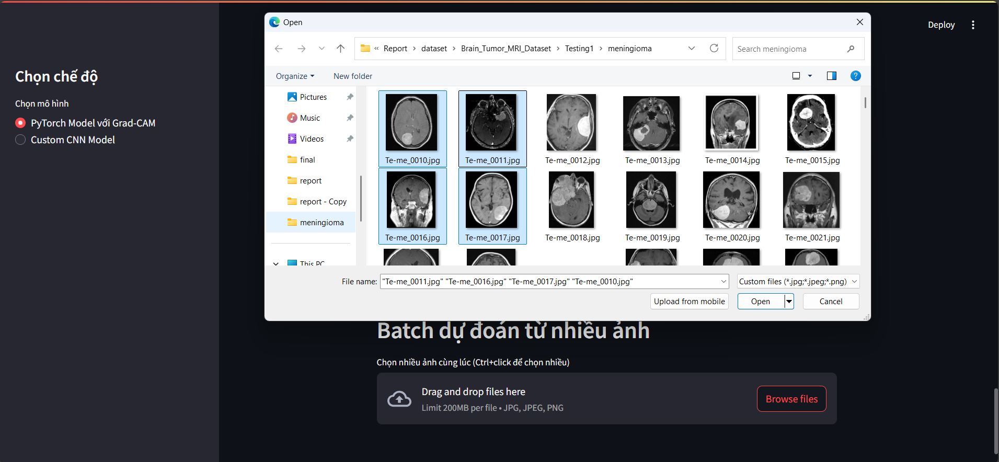
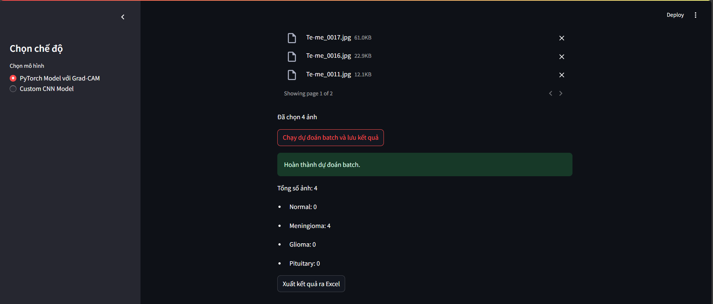

# Brain Tumor MRI Classifier (Streamlit App)

This is a **Streamlit web app** for brain tumor classification from MRI images using two models:

- **Pre-trained PyTorch CNN** with Grad-CAM visualization  
- **Custom CNN Framework** with layer-wise feature map inspection

Supports 4 classes:  
**Normal**, **Meningioma**, **Glioma**, **Pituitary**

---

## Features

### PyTorch Model
- Grad-CAM visualization for single image
- Batch prediction with result export to Excel
- Bar chart of class probabilities

### Custom CNN Model
- Layer-by-layer feature map visualization
- Support for both single and batch prediction
- Feature maps saved as `.png` or `.npy`

---

## Requirements

Install dependencies:

```bash
pip install streamlit torch torchvision opencv-python matplotlib pandas scikit-learn pytorch-grad-cam
```
## Run app
1. **Main display**
  
*Figure 1: Dashboard*
2. **Chosing image to test**
  
*Figure 2: Single image*
3. **Check prediction**
  
*Figure 3: Check prediction*
4. **Check prediction**
  
*Figure 4: Check grad-cam*
5. **Check prediction**
  
*Figure 5: Check feature-map*
6. **Chosing multi images**
  
*Figure 6: Chosing multi images*
7. **Check multi result**
  
*Figure 7: Check multi result*