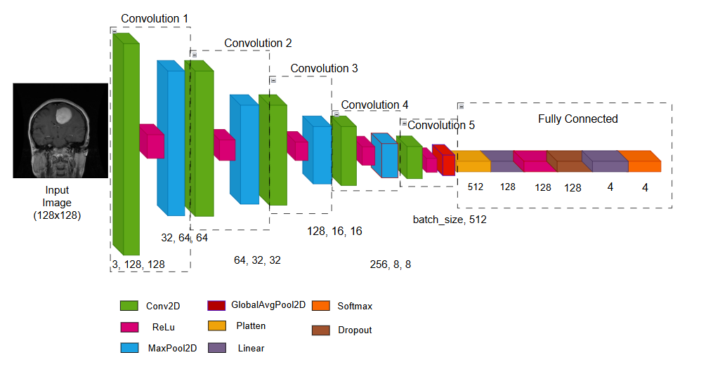
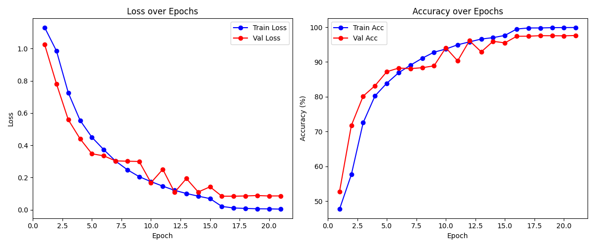

# Pytorch CNN Model for Brain Tumor Classification

This repository contains a pytorch Convolutional Neural Network (CNN) architecture designed for brain tumor classification using MRI images. The model supports four classes: **Normal**, **Meningioma**, **Glioma**, and **Pituitary**.

---

## 1. Network Architecture

The figure below illustrates the architecture of the custom CNN. It includes multiple convolutional layers, ReLU activations, max pooling, and fully connected layers.



*Figure 1: Custom CNN Architecture*

---

## 2. Training Results

The model was trained on an augmented MRI dataset. Below are the training and validation accuracy/loss plots over epochs.



*Figure 2: Training and Validation Accuracy/Loss*

Some key metrics:
- **Best Validation Accuracy**: 97.6%
- **Loss Function**: CrossEntropyLoss
- **Epochs**: 50
- **Learning Rate**: 0.001

---
## 3. Guide
### 3.1. Requirements

This project requires the following Python libraries:

```
pandas==2.2.3
Pillow==11.1.0
numpy==2.0.2
torch==2.6.0
grad-cam==1.5.5
torchvision==0.21.0
matplotlib==3.10.0
opencv-python==4.10.0.84
scikit-learn==1.6.0
seaborn==0.13.2
```

Can install all required libraries using pip:

```bash
pip install -r requirements.txt
```
### 3.2. How to run
* Start `python pytorch_model`, let user can manual `config.cfg` file:
```
[TRAINING]
epochs = 10
batch_size = 16
learning_rate = 0.001
patience = 5
use_scheduler = True
optimizer = adam

[DATA]
train_folder = C:/Personal/final_graduate/Report/dataset/Brain_Tumor_MRI_Dataset/Training
image_size = 28

[MODEL]
save_model_path = brain_tumor_model_1_001.pth
save_best_model_path = best_model_1.pth
save_plot_path = result_train_512_001.png
save_confusion_matrix_path = confusion_matrix_512_001.png
save_report_path = classification_report.txt
```

* After training, model was saved at `save_model_path = brain_tumor_model_1_001.pth`
* We can check to `load_save_test_result_to_sql` by run
```
python load_save_test_result_to_sql.py --model "C:/Personal/brain-tumor-detection/brain-tumor-detection-cnn/pytorch_model/models/brain_tumor_model_128_001_xoay.pth" --img-size 128 128 --output-db results.db
python load_save_test_result_to_sql.py --input-folder "C:/Personal/final_graduate/Report/dataset/Brain_Tumor_MRI_Dataset/Testing1" --model "C:/Personal/brain-tumor-detection/brain-tumor-detection-cnn/pytorch_model/models/brain_tumor_model_128_001_xoay.pth" --img-size 128 128 --output-db results.db
```
* Export db file to excel
```
python export_to_excel.py --input predictions.db --output predictions_labeled.xlsx
python export_to_excel.py --input "C:/Personal/brain-tumor-detection/brain-tumor-detection-cnn/pytorch_model/data/raw/prediction_128.db" --output predictions_labeled.xlsx
```
* Can manual using grad_cam
```
python grad_cam.py --input "C:/Personal/final_graduate/Report/dataset/Brain_Tumor_MRI_Dataset/Testing1/glioma/Te-gl_0044.jpg" --model "C:/Personal/brain-tumor-detection/brain-tumor-detection-cnn/pytorch_model/models/brain_tumor_model_128_001_xoay.pth" --output gradcam_auto.png --img-size 224 224
```