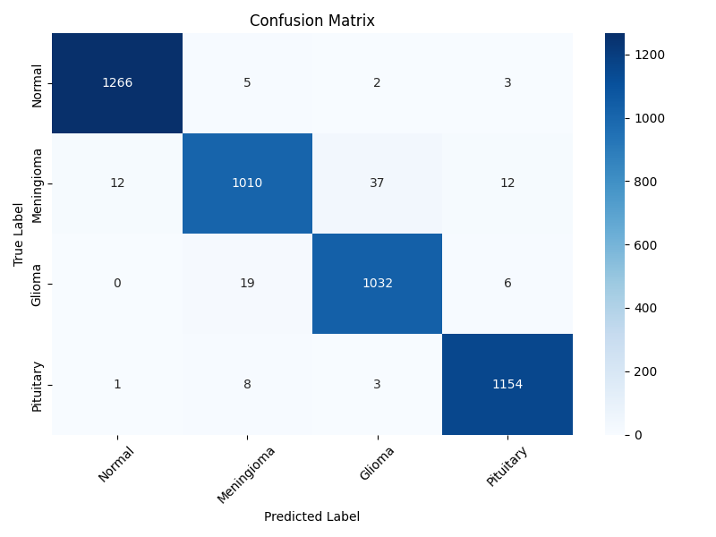

# Pytorch CNN Model for Brain Tumor Classification

This repository contains a pytorch Convolutional Neural Network (CNN) architecture designed for brain tumor classification using MRI images. The model supports four classes: **Normal**, **Meningioma**, **Glioma**, and **Pituitary**.

---

## 1. Network Architecture

The figure below illustrates the architecture of the custom CNN. It includes multiple convolutional layers, ReLU activations, max pooling, and fully connected layers.


*Figure 1: Custom CNN Architecture*

---

## 2. Training Results

The model was trained on an augmented MRI dataset. Below are the training and validation accuracy/loss plots over epochs.


*Figure 2: Training and Validation Accuracy/Loss*

Some key metrics:
- **Best Validation Accuracy**: 97.6%
- **Loss Function**: CrossEntropyLoss
- **Epochs**: 50
- **Learning Rate**: 0.001
### Epoch Logs:
```
Epoch [01/50] | Train Loss: 1.1308, Acc: 47.68% | Val Loss: 1.0247, Acc: 52.76% | Time: 563.18s
Epoch [02/50] | Train Loss: 0.9855, Acc: 57.61% | Val Loss: 0.7811, Acc: 71.75% | Time: 546.92s
Epoch [03/50] | Train Loss: 0.7259, Acc: 72.55% | Val Loss: 0.5587, Acc: 80.18% | Time: 527.78s
Epoch [04/50] | Train Loss: 0.5547, Acc: 80.24% | Val Loss: 0.4405, Acc: 83.17% | Time: 549.14s
Epoch [05/50] | Train Loss: 0.4500, Acc: 83.89% | Val Loss: 0.3476, Acc: 87.20% | Time: 547.13s
Epoch [06/50] | Train Loss: 0.3735, Acc: 86.90% | Val Loss: 0.3350, Acc: 88.25% | Time: 545.03s
Epoch [07/50] | Train Loss: 0.3026, Acc: 89.07% | Val Loss: 0.3038, Acc: 88.10% | Time: 539.16s
Epoch [08/50] | Train Loss: 0.2487, Acc: 91.08% | Val Loss: 0.3016, Acc: 88.36% | Time: 529.91s
Epoch [09/50] | Train Loss: 0.2058, Acc: 92.82% | Val Loss: 0.2999, Acc: 88.88% | Time: 538.84s
Epoch [10/50] | Train Loss: 0.1749, Acc: 93.72% | Val Loss: 0.1682, Acc: 94.09% | Time: 528.04s
Epoch [11/50] | Train Loss: 0.1469, Acc: 94.94% | Val Loss: 0.2513, Acc: 90.33% | Time: 525.74s
Epoch [12/50] | Train Loss: 0.1210, Acc: 95.79% | Val Loss: 0.1089, Acc: 96.13% | Time: 534.92s
Epoch [13/50] | Train Loss: 0.1013, Acc: 96.60% | Val Loss: 0.1940, Acc: 92.91% | Time: 536.05s
Epoch [14/50] | Train Loss: 0.0849, Acc: 97.01% | Val Loss: 0.1107, Acc: 95.95% | Time: 529.32s
Epoch [15/50] | Train Loss: 0.0696, Acc: 97.64% | Val Loss: 0.1427, Acc: 95.49% | Time: 534.82s
Epoch [16/50] | Train Loss: 0.0212, Acc: 99.48% | Val Loss: 0.0845, Acc: 97.40% | Time: 526.19s
Epoch [17/50] | Train Loss: 0.0114, Acc: 99.79% | Val Loss: 0.0845, Acc: 97.42% | Time: 531.77s
Epoch [18/50] | Train Loss: 0.0087, Acc: 99.79% | Val Loss: 0.0861, Acc: 97.57% | Time: 531.61s
Epoch [19/50] | Train Loss: 0.0066, Acc: 99.87% | Val Loss: 0.0886, Acc: 97.55% | Time: 537.41s
Epoch [20/50] | Train Loss: 0.0059, Acc: 99.90% | Val Loss: 0.0860, Acc: 97.53% | Time: 527.53s
Epoch [21/50] | Train Loss: 0.0043, Acc: 99.91% | Val Loss: 0.0864, Acc: 97.61% | Time: 525.23s
Early stopping at epoch 22
```

### Classification Report:
```
Classification Report:

              precision    recall  f1-score   support

      Normal     0.9898    0.9922    0.9910      1276
  Meningioma     0.9693    0.9430    0.9560      1071
      Glioma     0.9609    0.9763    0.9686      1057
   Pituitary     0.9821    0.9897    0.9859      1166

    accuracy                         0.9764      4570
   macro avg     0.9755    0.9753    0.9754      4570
weighted avg     0.9764    0.9764    0.9763      4570
```

### Confusion Matrix:

  
*Figure 3: Confusion Matrix on Test Set*

---
## 3. Guide
### 3.1. Requirements

This project requires the following Python libraries:

```
pandas==2.2.3
Pillow==11.1.0
numpy==2.0.2
torch==2.6.0
grad-cam==1.5.5
torchvision==0.21.0
matplotlib==3.10.0
opencv-python==4.10.0.84
scikit-learn==1.6.0
seaborn==0.13.2
```

Can install all required libraries using pip:

```bash
pip install -r requirements.txt
```
### 3.2. How to run
* Start `python pytorch_model`, let user can manual `config.cfg` file:
```
[TRAINING]
epochs = 10
batch_size = 16
learning_rate = 0.001
patience = 5
use_scheduler = True
optimizer = adam

[DATA]
train_folder = C:/Personal/final_graduate/Report/dataset/Brain_Tumor_MRI_Dataset/Training
image_size = 28

[MODEL]
save_model_path = brain_tumor_model_1_001.pth
save_best_model_path = best_model_1.pth
save_plot_path = result_train_512_001.png
save_confusion_matrix_path = confusion_matrix_512_001.png
save_report_path = classification_report.txt
```

* After training, model was saved at `save_model_path = brain_tumor_model_1_001.pth`
* We can check to `load_save_test_result_to_sql` by run
```
python load_save_test_result_to_sql.py --model "C:/Personal/brain-tumor-detection/brain-tumor-detection-cnn/pytorch_model/models/brain_tumor_model_128_001_xoay.pth" --img-size 128 128 --output-db results.db
python load_save_test_result_to_sql.py --input-folder "C:/Personal/final_graduate/Report/dataset/Brain_Tumor_MRI_Dataset/Testing1" --model "C:/Personal/brain-tumor-detection/brain-tumor-detection-cnn/pytorch_model/models/brain_tumor_model_128_001_xoay.pth" --img-size 128 128 --output-db results.db
```
* Export db file to excel
```
python export_to_excel.py --input predictions.db --output predictions_labeled.xlsx
python export_to_excel.py --input "C:/Personal/brain-tumor-detection/brain-tumor-detection-cnn/pytorch_model/data/raw/prediction_128.db" --output predictions_labeled.xlsx
```
* Can manual using grad_cam
```
python grad_cam.py --input "C:/Personal/final_graduate/Report/dataset/Brain_Tumor_MRI_Dataset/Testing1/glioma/Te-gl_0044.jpg" --model "C:/Personal/brain-tumor-detection/brain-tumor-detection-cnn/pytorch_model/models/brain_tumor_model_128_001_xoay.pth" --output gradcam_auto.png --img-size 224 224
```