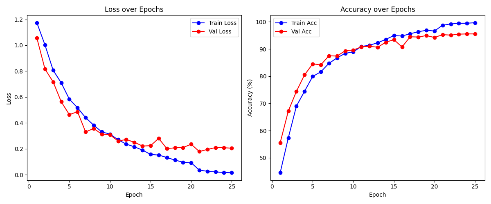

# Pytorch CNN Model for Brain Tumor Classification

This repository contains a pytorch Convolutional Neural Network (CNN) architecture designed for brain tumor classification using MRI images. The model supports four classes: **Normal**, **Meningioma**, **Glioma**, and **Pituitary**.

---

## 1. Network Architecture

The figure below illustrates the architecture of the custom CNN. It includes multiple convolutional layers, ReLU activations, max pooling, and fully connected layers.


*Figure 1: Custom CNN Architecture*

---

## 2. Training Results

The model was trained on an augmented MRI dataset. Below are the training and validation accuracy/loss plots over epochs.



*Figure 2: Training and Validation Accuracy/Loss*

Some key metrics:
- **Best Validation Accuracy**: 95.54%
- **Loss Function**: CrossEntropyLoss
- **Epochs**: 50
- **Learning Rate**: 0.001

---

### 3.1. Requirements

This project requires the following Python libraries:

- os, sys, shutil, io
- tkinter (GUI)
- numpy
- opencv-python (cv2)
- PIL (Pillow)
- pandas
- matplotlib
- seaborn
- torch
- scikit-learn
- tqdm
- psutil
- scipy
- warnings

Can install all required libraries using pip:

```bash
pip install -r requirements.txt
```
